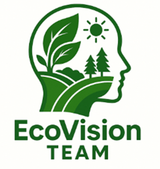
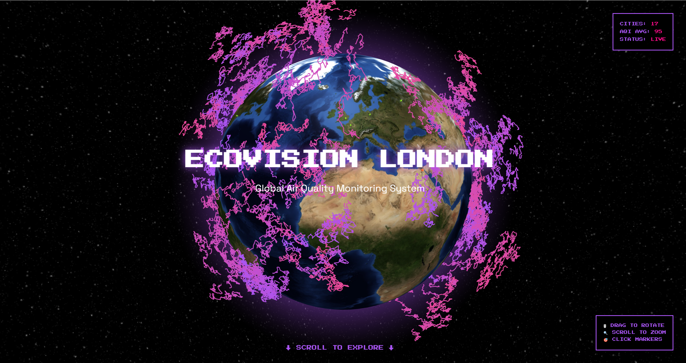
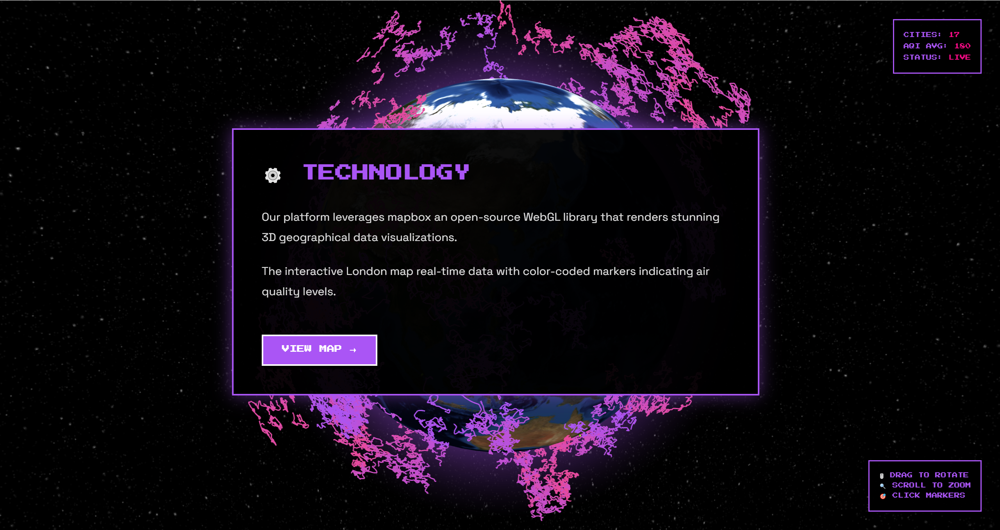
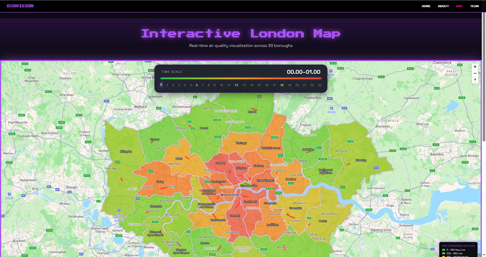
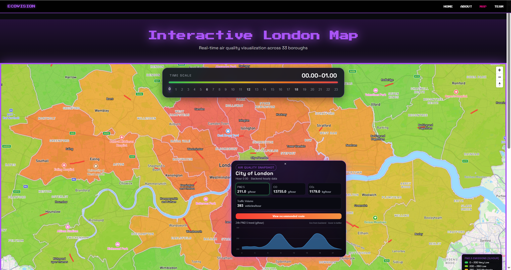
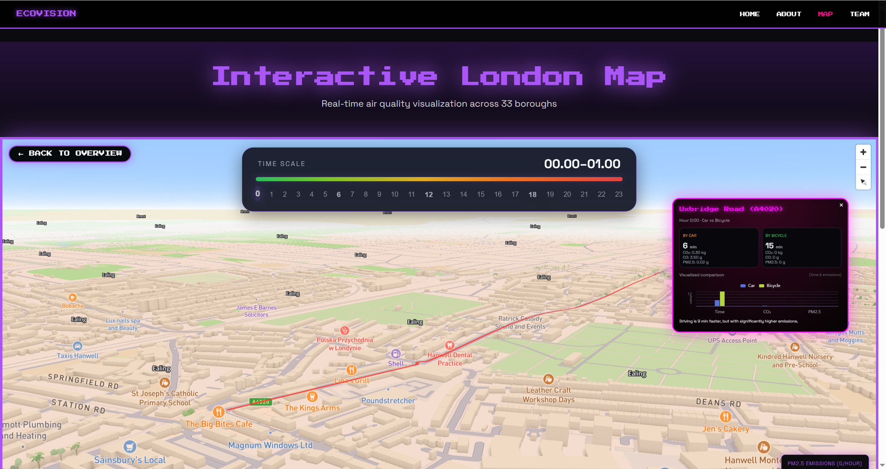
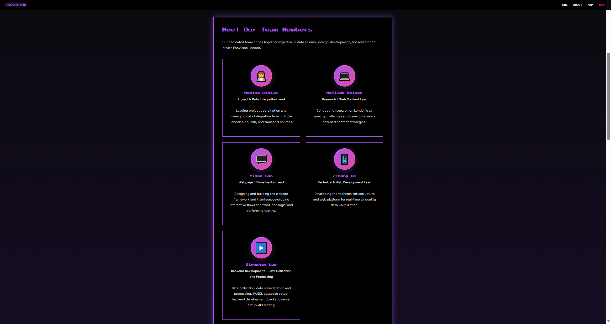
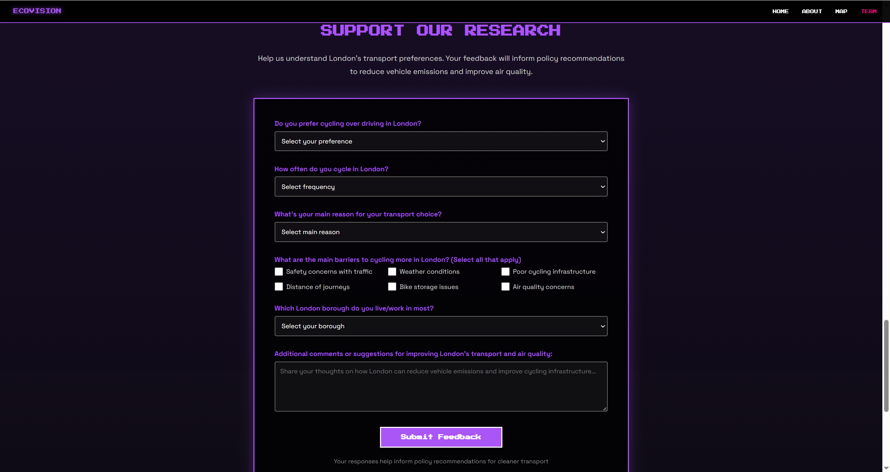

# 🌿 EcoVision Team  
### CASA0017 – Web Architecture | University College London (UCL)  



## 🌱 Who We Are  

**EcoVision** is a collaborative student team from the **Centre for Advanced Spatial Analysis (CASA)** at **University College London**.  
Our mission is to **translate complex environmental data into clear, engaging, and interactive web experiences** that inspire people to understand and act on sustainability challenges.  

We combine **data, design, and digital storytelling** to reveal the invisible patterns shaping our cities — from emissions and mobility to air quality and green space.


## 🎥 Map Tutorial Video

You can watch our tutorial video to learn how to interact with the **EcoVision Interactive London Map**.

[▶️ Click to Watch the Tutorial Video](https://github.com/xms12138/casa0017-web-assessment-EcoVision/releases/download/v1.0/Video_Tutorial.mp4)

This video demonstrates:

- Exploring different London boroughs and viewing real-time air quality data  
- Using the **time slider** to switch between hours of the day  
- Interpreting the **map legend** and understanding color gradients  
- Viewing detailed borough information through **popup panels**  
- Navigating between map layers and 3D visualization modes  

This tutorial helps users understand how to effectively use the EcoVision map to explore London's environmental data interactively.


## 🗺️ How to Use Our Map

### 1. Access on the UCL Lab Network (Recommended)

If you are connected to the CASA/UCL lab local network, you can directly access the deployed version of our map:

👉 `http://10.129.111.18:3000/casa0017-web-assessment-EcoVision/`

No additional setup is required in this case. We deployed all servers on Raspberry Pi.

---

### 2. Access Outside the Local Network

Outside the lab network, the Raspberry Pi deployment is not publicly accessible.  
If you would like to explore or run the EcoVision map yourself, please clone the repository and run both the **frontend** and **backend** locally.

Project structure (relevant parts):

```text
Website/
  ├─ back-end/        # Node.js + Express + MySQL API
  └─ front-end/
       └─ Final_Version/   # Vue 3 + Vite + Mapbox GL JS web client
```

---

📘 More Details on Frontend Configuration If you’d like to learn more about how to configure and run the frontend server in detail   (including port setup, environment variables, and build instructions),   please refer to the dedicated README file here: 👉 [Website/front-end/Final_Version/README.md](./Website/front-end/Final_Version/README.md) 


## 💡 Project Overview  

Our flagship project, **EcoVision Team**, visualises how **vehicle emissions**, **traffic flow**, and **air quality** interact across **London’s 33 boroughs**.  

Through our interactive website, users can:  
- View **hourly changes in CO₂, CO and PM2.5 emissions** alongside traffic levels.  
- Explore **borough-specific insights** and sustainability tips.  
- Compare **cycling vs car journey times** to promote greener travel.  

By transforming open datasets into interactive maps and data stories, **EcoVision helps Londoners make informed decisions** for a cleaner, more sustainable future.

---


## 🚀 Preview

#### 🌐 Live Demo
You can explore the deployed version of our website here:  
🔗 http://10.129.111.18:3000/casa0017-web-assessment-EcoVision/ 

> *Note: The website is hosted on a local Raspberry Pi server, accessible within the same LAN network.*

#### Home Page

When you access our website, you can find this homepage. The homepage features a rotating 3D globe visualizing global air quality patterns in real time, representing EcoVision London as a futuristic air monitoring system.




---

#### Map Entrance

After scrolling down on the homepage, you can see the entry for the map.




---

#### Map Page
After clicking to enter the map, you can see the overview. For each region, we have selected the busiest route (the red line in the figure). The colors here are displayed based on the PM2.5 concentration in each region at the selected time.




---

#### Air Quality Windows
Click on any of these 33 areas, and you will be able to see the current air quality and traffic flow for the selected time. There are also visual charts created using Echart.




---

#### 3D Perspective 

If you click on "View Recommended Route" in Windows, you can rotate the camera position to align it with the 3D perspective of that road. And there will be a comparison of the data from those who drive and those who ride this road.




---

#### Team Member

If you click the "Team" button, it will lead you to the team introduction page.




---

#### Questionnaire

Scroll down from the "team" page and you will see our questionnaire. These data will be sent to the backend for storage and analysis.




---


## 🧩 Tech Stack

### Frontend Implementation:

The frontend is built as a single-page application using **Vue 3** and **Vite**, with a strong focus on interactive mapping and clear visual storytelling.

Key elements:

- **Vue 3 + Vite**
  - Component-based architecture for pages such as the landing page, London map view, team page, and documentation.
  - Vite is used for fast development (`npm run dev`) and optimized production builds (`npm run build`).

- **3D Map Visualization with Mapbox GL JS**
  - Interactive 3D map of **33 London boroughs**, styled using custom Mapbox layers.
  - Borough polygons loaded from GeoJSON and rendered with:
    - Colored fill layers for each borough
    - Highlighted outlines
    - Borough name labels
  - Additional line layers used to display “busiest streets” and map-matched routes.

- **Time-Based Data Exploration**
  - A custom timeline / slider component allows users to browse hourly air quality values.
  - Map styles and sidebar panels react to the selected hour, updating pollution metrics in real time.

- **UI & Experience**
  - A neon, futuristic visual style to match the EcoVision theme.
  - Smooth scroll hints, hover effects, and responsive layout for different screen sizes.
  - Clear navigation between homepage, map view, about section, and team information.

- **Deployment**
  - The built frontend is deployed on a **Raspberry Pi** and served via Vite preview or a static server.
  - **PM2** is used to keep the frontend process alive and automatically restart on reboot.


### Backend Implementation

The backend is implemented with **Node.js (Express)** and **MySQL**, providing a lightweight API layer between the data storage and the interactive map.

Key elements:

- **Express Server**
  - Exposes RESTful endpoints consumed by the Vue frontend.
  - Handles queries for hourly air quality values and recommended travel options.
  - Uses environment variables (`.env`) for database configuration to keep credentials secure.

- **MySQL Database**
  - Stores processed air quality and mobility data at **borough-hour** level.
  - Example tables:
    - `borough_hour` — hourly CO₂, CO, PM2.5, and related metrics for each borough.
    - `busiest_road` — key road segments and travel time comparisons (car vs bicycle).
  - Data is loaded via CSV imports and can be extended with IoT or external datasets.

- **API Endpoints (Examples)**
  - `GET /api/hourly?borough=<borough_code>`  
    Returns hourly pollution and summary metrics for the selected borough.
  - `GET /api/solution?borough=<borough_code>`  
    Returns suggested routes or transport modes with travel time comparisons.

- **Deployment on Raspberry Pi**
  - The backend runs on the Raspberry Pi as a persistent **PM2** process (e.g. `eco-backend`).
  - Listens on a dedicated port (e.g. `:3000`) and is accessible to the frontend over the local network.
  - PM2 and (optionally) systemd are used to:
    - keep the server running,
    - restart on failure,
    - and enable startup on boot.

Together, this stack forms a full end-to-end system: data stored in MySQL → served via Express APIs → visualized through a Vue + Mapbox 3D interface on the Raspberry Pi.


## 👥 Team & Contributions

**Team Name:** EcoVision  
**Module:** CASA0017 – Web Architecture  
**Institution:** University College London (UCL), MSc Connected Environments  

Our project was developed collaboratively by a multidisciplinary team combining expertise in UI/UX design, web development, data analysis, and project management. Each member played a vital role in shaping the EcoVision platform from concept to delivery.

| Member             | Role                                                         | Key Contributions                                            |
| :----------------- | :----------------------------------------------------------- | :----------------------------------------------------------- |
| **Madina Diallo**  | Project Manager                                              | Led overall project coordination, timeline management, and sprint planning. Ensured alignment between front-end, back-end, and data streams through weekly milestones and review meetings. Managed GitHub workflow, quality assurance, and documentation. |
| **Yidan Gao**      | Front-End Designer & Developer                               | Designed the full UI and implemented the front-end architecture using **Vue 3 + Vite**. Developed responsive layouts, navigation, and component structure (e.g., homepage, explore, solution, and team pages). Integrated **D3.js** for interactive charts, optimized performance, and maintained design consistency through SCSS and Vue Composition API. |
| **Matilda Nelson** | Data Research & Integration                                  | Collected and cleaned air quality and traffic datasets from the **London Datastore**, **DEFRA**, and **TfL Open Data**. Mapped pollution data (CO₂, NO₂, PM2.5) with traffic and cycling datasets. Contributed to data-driven storytelling, ensuring environmental insight guided design decisions. |
| **Qingshan Luo**   | Back-End Developer                                           | Built the **Node.js (Express)** server and designed the **MySQL** database structure. Implemented RESTful APIs (`/api/hourly`, `/api/solution`) that serve borough-level air quality and travel data to the frontend. Deployed backend and database on **Raspberry Pi**. |
| **Zihang He**      | Map Interaction & IoT DeveloperMap Interaction & IoT Developer | Focused on the development of **interactive map visualization**. Built the **Mapbox GL JS** module that renders all 33 London boroughs with polygon boundaries, borough labels, and 3D extrusions representing air quality intensity. Implemented dynamic layers for **busiest streets**, **map-matched road segments**, and **hourly pollution updates**. Connected the frontend with backend APIs to enable real-time data visualization. Deployed and tested the full system on **Raspberry Pi**, ensuring both IoT and web components run concurrently and communicate effectively. Additionally, maintained the **GitHub repository**, managing commits, version control, and collaborative code integration across the team. |

---

Together, the EcoVision team followed an **agile four-week sprint**, covering ideation, data processing, system development, integration, and deployment.  
Each member’s expertise contributed to a unified and functional system that visualizes London’s environmental data with clarity, interactivity, and purpose.

---

## 📜 Declaration of Authorship

We hereby declare that all the work presented in this project is original and completed by the members of the **EcoVision** team.  
All code, design, documentation, and data processing were carried out independently.  
While some functions were refined with the assistance of AI-based coding tools (e.g., for syntax optimization or debugging), all conceptual design, architecture, and implementation decisions were made by the authors themselves.  

No part of this submission has been plagiarised or copied from other sources without proper acknowledgment.  
All third-party assets and datasets used in this project have been cited and credited accordingly.

**Team Name:** EcoVision  
**Module:** CASA0017 – Web Architecture  
**Institution:** University College London  
**Date:** November 2025

---

## 🙏 Acknowledgements

We would like to express our sincere gratitude to **Dr. Steven Gray** for his guidance, feedback, and continuous support throughout the development of this project.  
Special thanks to **UCL CASA** for providing access to IoT hardware and computing facilities, and to **Mapbox**, **OpenStreetMap**, and the **London Air Quality Network (LAQN)** for their open data resources that made this work possible.

Finally, we also thank each team member for their dedication, creativity, and technical contributions that brought the EcoVision platform to life.
